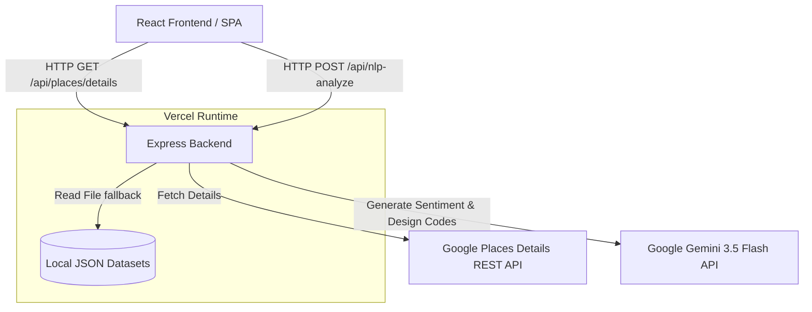

# Dubai Park Review Miner - Architecture & Features

This document provides a comprehensive technical overview of the **Dubai Park Review Miner** application, detailing its features, system design, data flows, and deployment configurations.

---

## 1. Application Overview
The **Dubai Park Review Miner** is a professional research and thematic analysis tool designed for landscape architects, urban planners, and designers. It enables researchers entering public park competitions in Dubai to compile Google Maps park reviews and Place metadata into NLP-ready datasets. 

By analyzing reviews, it automatically detects core architectural and landscaping issue categories (e.g., shade/heat comfort, playground standards, water features, universal accessibility) and auto-drafts structural design specifications.

---

## 2. Key Features

### 1. Interactive Park Directory & Search
- **Seeded Catalog**: Includes a pre-populated list of 8 iconic Dubai parks (e.g., Al Safa 2 Park, Zabeel Park, Safa Park, Creek Park) with exact geo-coordinates, ratings, and addresses.
- **Custom Location Expansion**: Allows researchers to input any custom Google Place ID manually to ingest reviews for other specific sites.

### 2. Interactive Vector GIS Map of Dubai
- Built using **React Leaflet** to project spatial coordinates on a vector map of Dubai.
- Highlights active parks with visual indicators and provides tooltips showing park name, rating, and coordinates.
- Integrates with the park directory to allow real-time toggling of park inclusions on the map.

### 3. Double-Engine NLP Pipeline
- **Local Offline Lexicon Engine**: Uses rule-based string scanning to categorize reviews against 16 key landscape tags and assign neutral placeholder design requirements immediately.
- **Gemini 3.5 Flash AI Engine**: Proxies calls server-side to the Gemini 3.5 Flash model, executing granular thematic analysis, keyword extraction, sentiment evaluation, and drafting professional, domain-specific landscape design specifications (e.g., using terms like *xerophytic native flora*, *porous EPDM tracks*, *Ghaf canopy microclimate shading*).

### 4. Thematic Dataset Explorer (Datagrid)
- A robust tabular interface that displays:
  - Park name, original review text, and star rating.
  - Extracted keywords, NLP-identified topic, and landscape issue category.
  - AI-generated design requirements.
- Supports search filtering, issue category filtering, and sentiment sorting.

### 5. Multi-Sheet Export Suite (SheetJS)
- Compiles processed research data and exports it into a multi-sheet **Excel (.xlsx)** spreadsheet:
  - **Sheet 1 (Parks Summary)**: Places metadata (Place ID, Geocoordinates, Google Rating, Map Links).
  - **Sheet 2 (Raw Reviews)**: Standard review records.
  - **Sheet 3 (NLP Dataset)**: Machine-learning-ready schema featuring `park_name`, `review_text`, `rating`, `sentiment`, `topic`, `issue_category`, and `design_requirement`.
- Also supports exporting as flat **CSV** and **JSON** formats.

---

## 3. System Architecture

The application is structured as a full-stack project designed to compile, build, and deploy as a single-unit codebase.



### 1. Frontend Client
- **Tech Stack**: React 19, TypeScript, Tailwind CSS (styling), Lucide React (icons), Motion (animation), Leaflet (map visualization), Recharts (data graphics).
- **SPA Router**: Runs client-side. The build outputs static files into the `/dist` directory.

### 2. Backend Server
- **Tech Stack**: Express, Node.js, `tsx` (for running TS server files in development).
- **Proxy Middleware**: Proxies calls to external APIs to hide credentials (API keys) on the server, avoiding any exposure in the browser inspector.
- **Vercel Adapter**: Configured via `/api/index.ts` to export the Express router as a Serverless function.

### 3. Data Integration & Fallback Strategy
To resolve park details and reviews, the backend runs a three-tier fallback pipeline:
1. **Local Scraped Datasets**: Resolves the request against local Apify scraped reviews stored in the `/dataset` folder.
2. **Google Places API (Live)**: If no matching local dataset file is found, it queries the live Google Places API (using `GOOGLE_MAPS_PLATFORM_KEY`).
3. **Pre-Seeded Fallback**: If no API key is available or the request fails, it serves high-quality pre-seeded sample data so the app remains fully functional.

---

## 4. Deployment Configuration

The repository is built for **Vercel** serverless environments using two primary files:

### 1. Serverless Routing (`vercel.json`)
Maps static asset hosting and API function execution. It uses the `functions` property to package the dataset files directly into the Serverless Lambda function bundle:
```json
{
  "version": 2,
  "functions": {
    "api/**/*": {
      "includeFiles": "dataset/**"
    }
  },
  "rewrites": [
    {
      "source": "/api/(.*)",
      "destination": "/api/index.ts"
    },
    {
      "source": "/(.*)",
      "destination": "/$1"
    }
  ]
}
```

### 2. API Entrypoint (`api/index.ts`)
Acts as the entrypoint for Vercel's serverless builder, exporting the Express application:
```typescript
import app from '../server.js';
export default app;
```

---

## 5. Security & Key Management

All API calls that interact with external services are proxied through server-side routes in `server.ts` to prevent exposing API keys in the client-side bundle:
- **`GOOGLE_MAPS_PLATFORM_KEY`**: Authenticates requests to the Google Places API.
- **`GEMINI_API_KEY`**: Authenticates requests to the Gemini 3.5 Flash API via the `@google/genai` SDK.

These keys are stored safely as **Environment Variables** in Google AI Studio / Vercel configurations and are never committed to Git.
