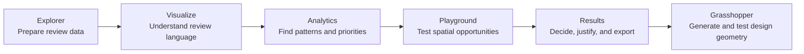
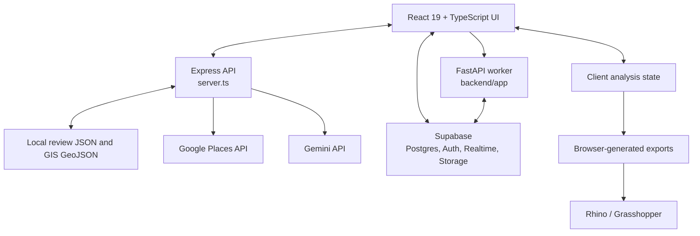
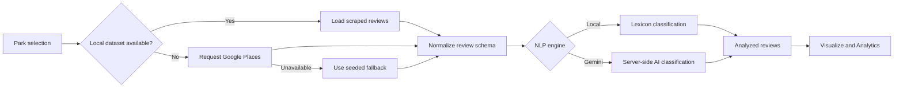
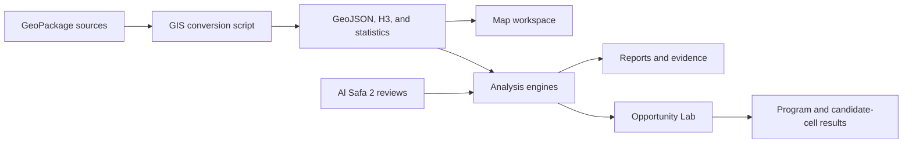
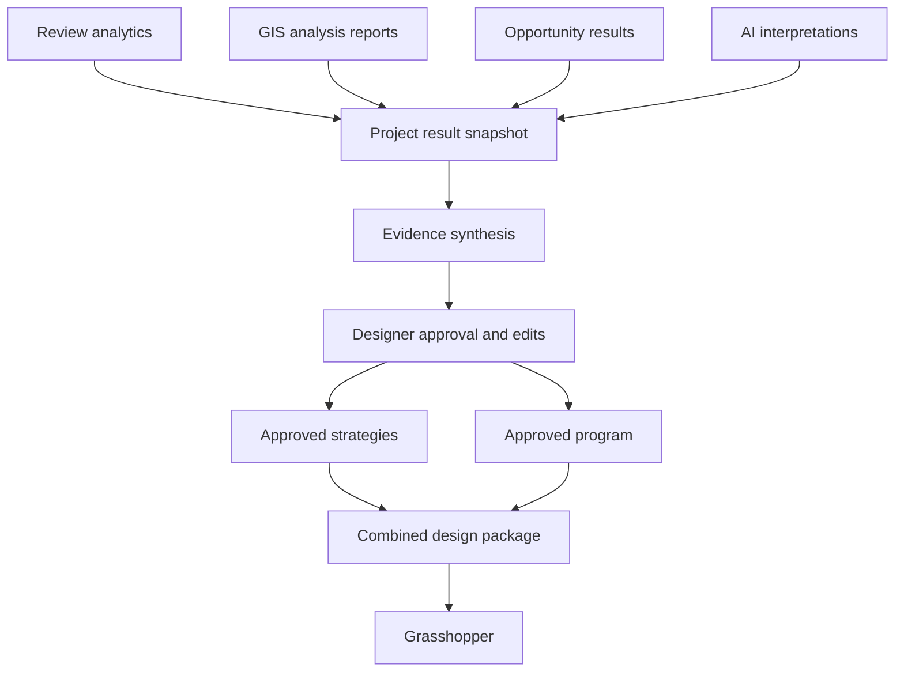

# Dubai Park Review Miner

## Project Description, Functional Architecture, and Technical Design

**Document status:** Current-state documentation with a proposed Results architecture  
**Primary study site:** Al Safa 2 Park, Dubai  
**Primary users:** Landscape architects, urban designers, planners, researchers, and competition teams

---

## 1. Project Summary

Dubai Park Review Miner is an evidence-to-design research platform for public parks. It combines visitor reviews, semantic analysis, spatial datasets, accessibility measures, environmental proxies, community indicators, and program-suitability calculations.

The project is intended to help a designer move through five stages:

1. Collect and prepare public review evidence.
2. Understand the language, topics, and sentiment in those reviews.
3. Identify trends, user groups, activities, issues, and opportunities.
4. Test those findings against site and urban data.
5. Convert the combined evidence into a design strategy and a Grasshopper-ready design package.

The existing application implements the first four stages. A fifth top-level **Results** tab is proposed as the synthesis, decision, and combined-export layer.



---

## 2. Product Objectives

The platform has four main objectives:

- **Research:** Turn unstructured Google Maps reviews into a searchable and analyzable dataset.
- **Diagnosis:** Identify recurring complaints, valued qualities, activities, user groups, seasonal patterns, and rating drivers.
- **Spatial reasoning:** Compare community needs with population, urban form, access, amenities, environmental proxies, and space syntax.
- **Design translation:** Convert evidence into traceable strategies, program requirements, spatial criteria, and computational-design inputs.

The platform is a decision-support tool. It does not replace site surveys, stakeholder engagement, authoritative demographic data, environmental monitoring, engineering studies, or professional design judgement.

---

## 3. Current Product Structure

| Top-level tab | Purpose | Principal inputs | Principal outputs | Status |
|---|---|---|---|---|
| Explorer | Select parks, acquire reviews, run NLP, filter records, and export review datasets | Local scraped reviews, Google Places responses, seeded fallback data | Analyzed review records and Excel/CSV/JSON files | Implemented |
| Visualize | Provide a fast semantic overview of analyzed reviews | Analyzed reviews | Topic and sentiment summaries and visualizations | Implemented |
| Analytics | Perform deeper review-based analysis | Analyzed reviews and selected parks | KPIs, trends, benchmarks, personas, issues, topic networks, rating drivers, and review exploration | Implemented |
| Playground | Explore GIS layers and run site-analysis and opportunity engines | Al Safa 2 GIS layers, reviews, H3 grid, roads, amenities, and analysis statistics | Spatial reports, maps, program opportunities, candidate cells, and specialized exports | Implemented |
| Results | Combine all analysis into an approved design brief, strategy, program, and unified Grasshopper package | Review analytics, spatial reports, opportunity results, assumptions, and designer choices | Evidence ledger, strategy, selected program, spatial rules, and combined export | Proposed |

### 3.1 Explorer

Explorer is the data-ingestion and NLP workspace. It provides:

- A pre-seeded Dubai park directory.
- Park selection and custom Google Place ID input.
- Server-proxied Google Places detail retrieval.
- Local Apify dataset loading before live API fallback.
- Local lexicon-based NLP for fast/offline analysis.
- Gemini-based NLP through the server API.
- Review filtering by rating, category, sentiment, and text.
- Review-level topic, issue, sentiment, keyword, confidence, and design-requirement fields.
- Review exports to Excel, CSV, and JSON.

The local NLP engine is deterministic and keyword based. The Gemini path provides a richer semantic interpretation but remains AI-generated analysis and must be labeled accordingly.

### 3.2 Visualize

Visualize provides a compact overview of the current analyzed-review selection. Its role is exploratory: it helps the user understand the broad semantic composition of a dataset before entering the deeper Analytics workspace.

It should remain focused on high-level questions such as:

- Is discussion mostly positive, negative, or neutral?
- Which issues dominate the review corpus?
- Which topics and design requirements recur?
- How do selected parks differ at a glance?

### 3.3 Analytics

Analytics is the deeper review-intelligence workspace. Its internal pages currently cover:

- Overview KPIs and park health scores.
- Review-volume and sentiment trends.
- Cross-park benchmarking.
- Seasonal and temporal patterns.
- Issue impact and topic distribution.
- Review-derived opportunities.
- Rating-driver analysis.
- Word and phrase analytics.
- Topic co-occurrence networks.
- Persona and user-group signals.
- Park-level GIS visualization.
- Detailed review exploration.

Analytics operates on the analyzed reviews owned by the main React application state. Review-derived personas represent evidence of mentioned user groups; they are not a substitute for verified demographic segments.

### 3.4 Playground

Playground is the GIS and site-analysis workbench. It is currently centered on Al Safa 2 Park and includes:

- A layer-based map workspace.
- An H3-cell inspector and data table.
- Spatial charts.
- Analysis engines.
- Opportunity Lab.
- Analysis history.
- GeoJSON, CSV, screenshot, and Grasshopper-oriented exports.

The analysis engine supports:

| Engine | Main purpose |
|---|---|
| Population | Population distribution, density, pressure, demand, and service indicators |
| Urban | Urban morphology, built coverage, land-use proxies, road structure, and development pressure |
| Accessibility | Walking catchments, network access, public transport, entrances, barriers, parking, and pedestrian quality |
| Environmental | Green coverage, imperviousness, heat-exposure proxy, cooling opportunities, biodiversity proxy, and planting opportunities |
| Community | Facility access, family/youth/older-adult demand proxies, vulnerability, and social-program demand |
| NLP Spatial | Review cleaning, topics, complaints, positive features, user groups, temporal evidence, and design requirements |
| Space Syntax | Integration, choice, degree, and important network junctions |
| AI Design Assistant | Evidence-grounded interpretation and recommended interventions through Gemini or a deterministic fallback |

#### Opportunity Lab

Opportunity Lab converts analysis signals into program-specific assessments. Each opportunity can contain:

- Program name and category.
- Geometry type and scale.
- Opportunity, demand, suitability, feasibility, confidence, and Grasshopper-readiness scores.
- Primary users.
- Supporting evidence.
- Recommended area range.
- Adjacency requirements.
- Avoidance conditions and constrained cells.
- Ranked candidate cells.
- Grasshopper attractors, repellers, constraints, and movement rules.

Opportunity scores are directional planning composites. They should not be presented as measured site performance or as a mathematically unique design answer.

### 3.5 Proposed Results Tab

Results should be the synthesis and decision layer rather than another dashboard. It should answer:

1. What did the analyses establish?
2. Which findings matter most to the design?
3. Where do different evidence sources reinforce or contradict one another?
4. Which strategies and programs does the designer approve?
5. What should be exported to Grasshopper?

Recommended Results sections:

#### A. Analysis Readiness

- List completed, missing, stale, and failed analyses.
- Show dataset versions and analysis timestamps.
- Warn when results come from different sites or review selections.
- Prevent a combined export when essential spatial inputs are missing.

#### B. Executive Design Brief

- Project and study-area summary.
- Community voice summary.
- Strengths to retain.
- Problems to resolve.
- Site constraints.
- Highest-value opportunities.
- Editable design vision.

#### C. Evidence Synthesis Matrix

Each design driver should connect review evidence, spatial evidence, an interpretation, limitations, and confidence.

| Design driver | Review evidence | Spatial evidence | Design interpretation | Evidence nature |
|---|---|---|---|---|
| Thermal comfort | Shade and heat complaints | Green deficit and heat-exposure proxy | Create continuous shaded movement and dwell areas | Derived/proxy |
| Family activity | Family and playground mentions | Facility and playground-deficit signals | Prioritize inclusive play and family support facilities | Mixed |
| Accessibility | Access complaints | Network walking time and barrier indicators | Improve accessible routes and entrances | Mixed |
| Landscape identity | Positive greenery sentiment | Existing green-area data | Retain valued landscape character | Mixed |

#### D. Design Strategy Builder

Every proposed strategy should contain:

- Title and design intent.
- Supporting and conflicting evidence.
- Target user groups.
- Related programs.
- Spatial criteria.
- Performance objective.
- Confidence and limitations.
- Designer status: proposed, accepted, modified, or rejected.

#### E. Program and Spatial Brief

The designer should be able to select programs and edit:

- Priority and quantity.
- Minimum, target, and maximum area.
- Primary users.
- Shade, access, visibility, and noise requirements.
- Preferred, avoided, service, and movement adjacencies.
- Candidate cells and exclusions.
- Designer notes and assumptions.

#### F. Export Center

Results should generate a single versioned design package containing the approved strategy, programs, spatial fields, evidence, assumptions, and methodology.

---

## 4. System Architecture

The repository currently contains two backend paths:

1. An active Express server that serves the React application, local datasets, GIS layers, Google Places requests, Gemini requests, and deterministic fallbacks.
2. An emerging FastAPI/Supabase worker architecture for authenticated projects, dataset versioning, processing, analysis-run lifecycle management, metrics, and generated outputs.



### 4.1 Frontend

- React 19 and TypeScript.
- Vite build tooling.
- Tailwind CSS for visual styling.
- React Leaflet and Leaflet Draw for maps and geometry interaction.
- Recharts for charts.
- TanStack Table for data tables.
- Turf for spatial operations.
- D3 Force and XYFlow for semantic and opportunity networks.
- SheetJS for spreadsheet exports.
- Supabase JavaScript client for authentication, project data, storage, and realtime updates.

### 4.2 Express Application Server

`server.ts` is the current full-stack runtime used by `npm run dev` and the bundled production server. It provides:

- Static frontend delivery.
- Local review-dataset resolution.
- Local GIS dataset endpoints.
- Google Places proxying.
- Gemini NLP analysis.
- Evidence-grounded AI interpretations for population, urban, accessibility, environmental, community, NLP-spatial, and design-strategy workflows.
- Deterministic fallbacks when an AI call is unavailable or unsuccessful.

The Vercel adapter in `api/index.ts` exports this Express application as a serverless entry point. `vercel.json` includes the local dataset directory in the function bundle and rewrites `/api/*` requests to that entry point.

### 4.3 FastAPI Worker

The Python service under `backend/app` provides the foundation for asynchronous, persistent analysis workflows:

- Supabase service-role access.
- Dataset validation and processing.
- Dataset-version creation.
- Analysis-run status transitions.
- Analysis-metric insertion.
- Storage download/upload helpers.
- Generated-output registration.

The current `/analysis-runs/{run_id}/execute-demo` route demonstrates the run lifecycle and metric-writing plumbing. It is not yet the primary implementation of the browser-based GIS and NLP engines.

### 4.4 Supabase

The repository contains clients and migrations for a project-oriented persistence model involving:

- Profiles and application settings.
- Parks and projects.
- Datasets and immutable dataset versions.
- Analysis runs and analysis-run input lineage.
- H3 cells and analysis metrics.
- Reviews, review topics, and design requirements.
- Network assets.
- Generated outputs.
- Raw datasets and output-storage buckets.
- Row Level Security and Realtime publication policies.

Important: the migration folder only contains the later migrations. Earlier schema changes were created in the Supabase SQL Editor and have not yet been pulled into source control. The live database is therefore authoritative until `supabase db pull` is completed.

---

## 5. Data Architecture

### 5.1 Review Data

The repository currently contains eight Google Maps review datasets with 7,907 total records:

- Al Safa 2 Park.
- Zabeel Park.
- Al Safa Park.
- Creek Park.
- Umm Suqeim Park.
- Al Khazzan Park.
- Al Barsha Pond Park.
- Al Mankhool Park.

Review records include text, translated text, star rating, publication date, language, reviewer metadata, Google Place metadata, and park-level coordinates. Many records contain ratings without substantive review text.

Reviews do not contain per-facility or per-zone coordinates. Review-derived values must therefore remain park-level signals. Any redistribution over H3 cells is a disclosed analytical proxy, not observed spatial review activity.

### 5.2 GIS Data

The converted GIS workspace currently contains:

- 860 H3 cells.
- Buildings.
- Roads and a network graph.
- Parks.
- Schools, hospitals, clinics, and mosques.
- Restaurants, cafes, shops, toilets, and drinking-water points.
- Playgrounds, sports facilities, parking, and bus stops.
- Space-syntax nodes and summary statistics.
- Accessibility catchments, entrance nodes, barriers, and route metrics.

The principal source packages are:

- `gisdataset/AlSafa2_H3_Master_Analysis.gpkg`
- `gisdataset/AlSafa2_OSM_5km_AllLayers.gpkg`

`scripts/convert_gis_data.py` converts these packages into browser-friendly GeoJSON and JSON files under `dataset/gis`.

### 5.3 Spatial Reference Systems

- Web maps and stored GeoJSON coordinates use WGS 84 longitude/latitude.
- Grasshopper coordinates are forward-projected to UTM Zone 40N, EPSG:32640, in meters.
- Every export must state its CRS and units explicitly.

### 5.4 Evidence Classification

All result fields should carry an evidence nature:

| Nature | Meaning | Example |
|---|---|---|
| Measured/source | Directly present in an input dataset | Review rating, mapped road geometry |
| Derived | Calculated from source fields | Population density, walking time |
| Proxy | Indirect substitute for an unavailable measure | Surface-composition heat exposure |
| AI-generated | Language-model interpretation | Draft design strategy |
| Designer assumption | Explicit human decision | Target program area or weighting |

Confidence must express evidence adequacy, not design quality or certainty of success.

---

## 6. Core Data Flows

### 6.1 Review Analysis Flow



### 6.2 Playground Analysis Flow



### 6.3 Proposed Results Flow



---

## 7. Analysis and Scoring Principles

The project intentionally combines heterogeneous evidence. The following principles are required for defensible output:

1. Preserve raw values separately from normalized and weighted values.
2. Record the formula, weights, source fields, and version for every composite.
3. Mark missing variables as unavailable rather than inventing values.
4. Treat AI output as interpretation, never as a source measurement.
5. Preserve evidence excerpts and source identifiers behind every strategy.
6. Show conflicting evidence instead of collapsing it silently.
7. Allow designers to edit assumptions and weights.
8. Recalculate downstream outputs when an assumption changes.
9. Distinguish program-level confidence from cell-level suitability.
10. Keep park-level review evidence separate from exact spatial observations.

---

## 8. Export Architecture

### 8.1 Existing Exports

The project currently supports:

- Review Excel workbooks.
- Review CSV and JSON.
- GIS GeoJSON.
- H3 CSV.
- Map screenshots.
- Environmental Grasshopper JSON/CSV.
- Community Grasshopper JSON/CSV.
- NLP Grasshopper JSON/CSV.

Existing Grasshopper exports include projected centroids, analysis fields, program information, and methodology notes.

### 8.2 Proposed Combined Grasshopper Design Package

Results should generate one versioned package:

```text
<project>_design_package/
|-- project_manifest.json
|-- design_strategy.json
|-- programs.json
|-- programs.csv
|-- cells.geojson
|-- cells.csv
|-- adjacency_rules.csv
|-- evidence_register.csv
|-- constraints.geojson
|-- attractors.geojson
|-- repellers.geojson
`-- methodology.json
```

The package should contain three conceptually separate field groups:

- **Source facts:** geometry, coordinates, population, buildings, green coverage, roads, access, and facilities.
- **Derived analysis:** normalized metrics, proxies, opportunity values, suitability, feasibility, and constraints.
- **Design decisions:** approved programs, areas, quantities, priorities, weights, attractors, repellers, and adjacency rules.

`project_manifest.json` should identify the project, site, CRS, units, dataset versions, analysis versions, selected scenario, generated time, files, and field definitions.

---

## 9. Proposed Shared Results Model

The current frontend does not yet have one shared object containing all review, analysis, opportunity, and strategy results. A Results tab should be based on an explicit project snapshot rather than reading UI components directly.

```ts
interface ProjectResult {
  project: ProjectMetadata;
  reviewDataset: ReviewAnalysisSnapshot;
  population: PopulationAnalysisResult | null;
  urban: UrbanAnalysisResult | null;
  accessibility: AccessibilityAnalysisResult | null;
  environmental: EnvironmentalAnalysisResult | null;
  community: CommunityAnalysisResult | null;
  nlpSpatial: NlpSpatialAnalysisResult | null;
  spaceSyntax: SpaceSyntaxAnalysisResult | null;
  opportunities: OpportunityResult[];
  selectedPrograms: SelectedProgram[];
  designStrategies: DesignStrategy[];
  assumptions: Assumption[];
  evidenceRegister: EvidenceRecord[];
  exportVersion: string;
}
```

Recommended ownership:

- Store the active project, site, reviews, completed analysis results, and selected strategy in a project-level React context or reducer.
- Make analysis engines return typed result objects to that store.
- Make Opportunity Lab publish its complete result set and designer selections.
- Persist approved snapshots and export metadata through Supabase.
- Generate all Results views and combined exports from the same immutable snapshot.

---

## 10. Repository Structure

```text
dubai-park-review-miner/
|-- api/                       Vercel Express adapter
|-- backend/                   FastAPI/Supabase worker foundation
|   `-- app/
|       |-- routes/            Dataset and analysis-run endpoints
|       `-- services/          Processing, lifecycle, output, and storage services
|-- dataset/
|   |-- *.json                 Local Google Maps review datasets
|   `-- gis/                   Converted GeoJSON and analysis statistics
|-- gisdataset/                Source GeoPackage files
|-- scripts/                   GIS conversion pipeline
|-- src/
|   |-- components/
|   |   |-- analytics/         Review-analysis dashboards
|   |   |-- auth/              Authentication gate
|   |   |-- playground/        Map, analysis reports, and Opportunity Lab
|   |   |-- status/            Dataset/run status components
|   |   `-- ui/                Shared visual components
|   |-- lib/
|   |   |-- analytics/         Review analytics functions
|   |   |-- backend/           FastAPI client helpers
|   |   |-- gis/               GIS, report, opportunity, and export engines
|   |   |-- metrics/           Metric methodology registry
|   |   `-- supabase/          Auth, projects, datasets, runs, and output clients
|   |-- App.tsx                Top-level application and review state
|   `-- main.tsx               React entry point
|-- supabase/migrations/       Later database migrations and RLS changes
|-- tests/                     Current automated tests
|-- server.ts                 Express API and production application server
`-- PROJECT_ARCHITECTURE.md    This document
```

---

## 11. Security and Configuration

- Google Places and Gemini requests are proxied through the server so secret keys are not bundled into browser code.
- `GEMINI_API_KEY` and `GOOGLE_MAPS_PLATFORM_KEY` are server-only values.
- The Supabase anonymous key is used in the browser and remains constrained by Row Level Security.
- `SUPABASE_SERVICE_ROLE_KEY` is backend-only and must never use the `VITE_` prefix.
- Storage paths begin with the owning project identifier so RLS policies can enforce project ownership.
- Generated outputs should retain project, analysis-run, dataset-version, and creation-time lineage.

---

## 12. Current Architectural Limitations

### 12.1 Split frontend state

The main application owns selected parks and analyzed reviews, while Playground independently loads Al Safa 2 reviews. Results cannot reliably combine the application until those states are unified.

### 12.2 Local component results

Analysis reports and Opportunity Lab results are held inside their respective components. The parent currently receives only a short history summary from an analysis run, not the complete typed output.

### 12.3 Single-site GIS scope

Review analytics supports eight parks, but the detailed GIS and Opportunity Lab datasets are specific to Al Safa 2 and its study area. Cross-park review comparison must not imply that equivalent spatial evidence exists for every park.

### 12.4 Proxy-heavy spatial reasoning

Several environmental, demographic, community, and review-spatial values are proxies. The interface contains methodology caveats, but Results must make evidence nature and uncertainty prominent at the point of decision and export.

### 12.5 Dual backend transition

Express currently performs most production analysis/API work. FastAPI and Supabase provide a persistence and worker foundation but do not yet replace the browser analysis engines end to end.

### 12.6 Incomplete migration history

The complete live Supabase schema is not represented locally. A schema pull is required before the database migrations can be treated as a complete reproducible history.

### 12.7 Limited automated testing

The repository has extensive scoring and export logic but very little automated coverage. Formula tests, invariant tests, export-schema tests, data-lineage tests, and representative golden datasets are required before results are used for consequential design decisions.

---

## 13. Recommended Development Sequence

### Phase 1: Establish a shared project state

- Introduce typed project, analysis-result, evidence, strategy, and program models.
- Pass the selected site and analyzed reviews into Playground.
- Publish complete engine results and opportunities to the shared store.
- Attach dataset and formula versions to each result.

### Phase 2: Build Results synthesis

- Add the Results top-level tab.
- Add readiness and consistency checks.
- Build the evidence synthesis matrix.
- Generate editable strategies.
- Add accept, modify, and reject decisions.

### Phase 3: Build the approved program

- Let designers select programs and edit quantities and areas.
- Check total area, conflicts, support facilities, and missing evidence.
- Support alternative scenarios such as Family First, Climate First, and Balanced.

### Phase 4: Create the combined export

- Define and version the Grasshopper schema.
- Generate the manifest, cells, programs, adjacency, evidence, and methodology files.
- Validate CRS, units, identifiers, null handling, and field ranges.
- Add automated round-trip tests using a representative Grasshopper import definition.

### Phase 5: Persist and reproduce

- Store project snapshots, strategies, program selections, and generated outputs in Supabase.
- Connect browser analyses to persistent analysis runs.
- Complete the authoritative Supabase migration history.
- Allow users to reproduce or compare previous result versions.

---

## 14. Definition of a Successful Result

A successful project result is not simply a collection of charts or a high opportunity score. It is a traceable design proposition in which:

- Every major strategy links to evidence.
- Every evidence item identifies its source and nature.
- Missing evidence remains visible.
- Designer assumptions are explicit and editable.
- Program and spatial rules are machine-readable.
- Grasshopper receives stable identifiers, coordinates, units, constraints, and program criteria.
- Another designer can understand how the project moved from data to design.

The intended final chain is:

> **Source data -> analysis -> evidence -> interpretation -> designer decision -> program and spatial rules -> Grasshopper geometry**
