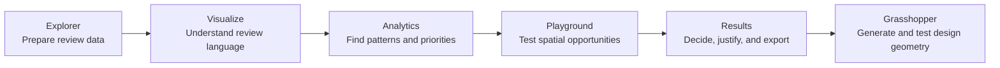
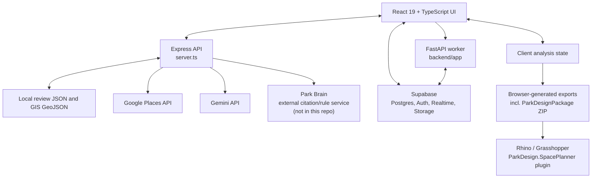
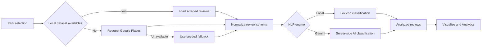
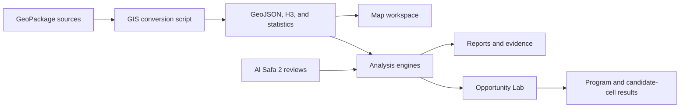
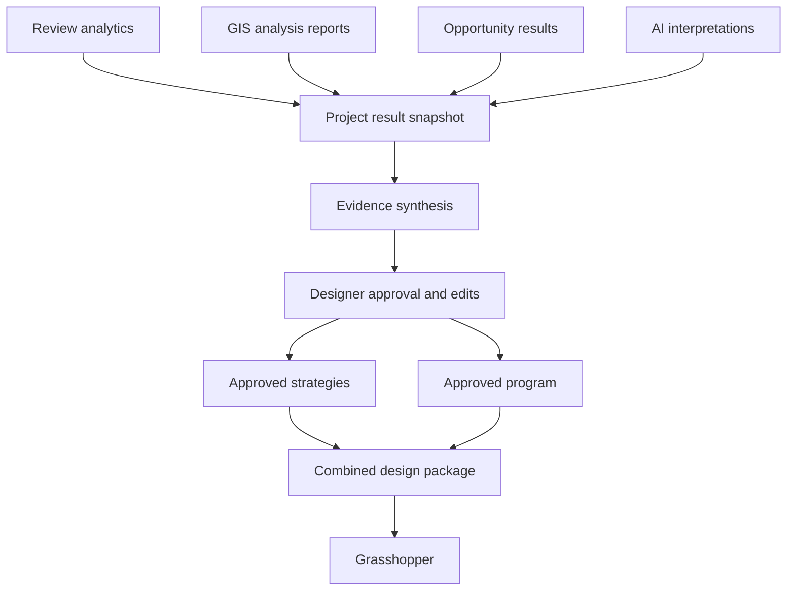

# Dubai Park Review Miner

## Project Description, Functional Architecture, and Technical Design

**Document status:** Current-state documentation, including the implemented Results tab (section 3.5), the Grasshopper plugin that consumes its export (section 3.6), and their still-aspirational surrounding architecture
**Primary study site:** Al Safa 2 Park, Dubai  
**Primary users:** Landscape architects, urban designers, planners, researchers, and competition teams

---

## 1. Project Summary

Dubai Park Review Miner is an evidence-to-design research platform for public parks. It combines visitor reviews, semantic analysis, spatial datasets, accessibility measures, environmental proxies, community indicators, and program-suitability calculations.

The project is intended to help a designer move through five stages:

1. Collect and prepare public review evidence.
2. Understand the language, topics, and sentiment in those reviews.
3. Identify trends, user groups, activities, issues, and opportunities.
4. Test those findings against site and urban data.
5. Convert the combined evidence into a design strategy and a Grasshopper-ready design package.

The existing application implements the first four stages. A fifth top-level **Results** tab implements the synthesis stage as a 6-tier Experience-to-Space matrix and persona-journey space graph, an evidence-gated standards/rule pipeline (Park Brain query guide and Approved Rule Compiler), and a versioned `ParkDesignPackage` ZIP export (section 3.5). A companion Rhino/Grasshopper plugin, `ParkDesign.SpacePlanner` (section 3.6), reads that ZIP and deterministically places the program. The full decision/combined-export layer described elsewhere in this document remains partly aspirational.



---

## 2. Product Objectives

The platform has four main objectives:

- **Research:** Turn unstructured Google Maps reviews into a searchable and analyzable dataset.
- **Diagnosis:** Identify recurring complaints, valued qualities, activities, user groups, seasonal patterns, and rating drivers.
- **Spatial reasoning:** Compare community needs with population, urban form, access, amenities, environmental proxies, and space syntax.
- **Design translation:** Convert evidence into traceable strategies, program requirements, spatial criteria, and computational-design inputs.

The platform is a decision-support tool. It does not replace site surveys, stakeholder engagement, authoritative demographic data, environmental monitoring, engineering studies, or professional design judgement.

---

## 3. Current Product Structure

| Top-level tab | Purpose | Principal inputs | Principal outputs | Status |
|---|---|---|---|---|
| Explorer | Select parks, acquire reviews, run NLP, filter records, and export review datasets | Local scraped reviews, Google Places responses, seeded fallback data | Analyzed review records and Excel/CSV/JSON files | Implemented |
| Visualize | Provide a fast semantic overview of analyzed reviews | Analyzed reviews | Topic and sentiment summaries and visualizations | Implemented |
| Analytics | Perform deeper review-based analysis | Analyzed reviews and selected parks | KPIs, trends, benchmarks, personas, issues, topic networks, rating drivers, and review exploration | Implemented |
| Playground | Explore GIS layers and run site-analysis and opportunity engines | Al Safa 2 GIS layers, reviews, H3 grid, roads, amenities, and analysis statistics | Spatial reports, maps, program opportunities, candidate cells, and specialized exports | Implemented |
| Results | Synthesize review analytics, the full Opportunity Lab space catalog, and infrared.city climate evidence into a 6-tier Age Group -> Archetype -> Activities -> Experience -> Space -> Scores matrix and persona-journey space graph; gate standards/rule evidence through Park Brain and an Approved Rule Compiler; and export a versioned Grasshopper design package | Review analytics, the real Al Safa 2 site grid and Opportunity Lab results, infrared.city seasonal UTCI/wind data, a fixed competition brief (budget/area caps), designer-tunable masterplan export settings, and (when available) the external Park Brain standards service | Experience-to-space matrix, Sankey flow diagram, budget/footprint check, shared-priority-space summary, full space graph with exhaustive per-archetype user journeys, a movement/access-candidate GIS overlay, a space-graph-and-journeys JSON export, and a 13-file `ParkDesignPackage` ZIP consumed directly by the `ParkDesign.SpacePlanner` Grasshopper plugin | Implemented |

### 3.1 Explorer

Explorer is the data-ingestion and NLP workspace. It provides:

- A pre-seeded Dubai park directory.
- Park selection and custom Google Place ID input.
- Server-proxied Google Places detail retrieval.
- Local Apify dataset loading before live API fallback.
- Local lexicon-based NLP for fast/offline analysis.
- Gemini-based NLP through the server API.
- Review filtering by rating, category, sentiment, and text.
- Review-level topic, issue, sentiment, keyword, confidence, and design-requirement fields.
- Review exports to Excel, CSV, and JSON.

The local NLP engine is deterministic and keyword based. The Gemini path provides a richer semantic interpretation but remains AI-generated analysis and must be labeled accordingly.

### 3.2 Visualize

Visualize provides a compact overview of the current analyzed-review selection. Its role is exploratory: it helps the user understand the broad semantic composition of a dataset before entering the deeper Analytics workspace.

It should remain focused on high-level questions such as:

- Is discussion mostly positive, negative, or neutral?
- Which issues dominate the review corpus?
- Which topics and design requirements recur?
- How do selected parks differ at a glance?

### 3.3 Analytics

Analytics is the deeper review-intelligence workspace. Its internal pages currently cover:

- Overview KPIs and park health scores.
- Review-volume and sentiment trends.
- Cross-park benchmarking.
- Seasonal and temporal patterns.
- Issue impact and topic distribution.
- Review-derived opportunities.
- Rating-driver analysis.
- Word and phrase analytics.
- Topic co-occurrence networks.
- Persona and user-group signals.
- Park-level GIS visualization.
- Detailed review exploration.

Analytics operates on the analyzed reviews owned by the main React application state. Review-derived personas represent evidence of mentioned user groups; they are not a substitute for verified demographic segments.

### 3.4 Playground

Playground is the GIS and site-analysis workbench. It is currently centered on Al Safa 2 Park and includes:

- A layer-based map workspace.
- An H3-cell inspector and data table.
- Spatial charts.
- Analysis engines.
- Opportunity Lab.
- Analysis history.
- GeoJSON, CSV, screenshot, and Grasshopper-oriented exports.

The analysis engine supports:

| Engine | Main purpose |
|---|---|
| Population | Population distribution, density, pressure, demand, and service indicators |
| Urban | Urban morphology, built coverage, land-use proxies, road structure, and development pressure |
| Accessibility | Walking catchments, network access, public transport, entrances, barriers, parking, and pedestrian quality |
| Environmental | Green coverage, imperviousness, heat-exposure proxy, cooling opportunities, biodiversity proxy, and planting opportunities |
| Community | Facility access, family/youth/older-adult demand proxies, vulnerability, and social-program demand |
| NLP Spatial | Review cleaning, topics, complaints, positive features, user groups, temporal evidence, and design requirements |
| Space Syntax | Integration, choice, degree, and important network junctions |
| AI Design Assistant | Evidence-grounded interpretation and recommended interventions through Gemini or a deterministic fallback |

#### Opportunity Lab

Opportunity Lab converts analysis signals into program-specific assessments. Each opportunity can contain:

- Program name and category.
- Geometry type and scale.
- Opportunity, demand, suitability, feasibility, confidence, and Grasshopper-readiness scores.
- Primary users.
- Supporting evidence.
- Recommended area range.
- Adjacency requirements.
- Avoidance conditions and constrained cells.
- Ranked candidate cells.
- Grasshopper attractors, repellers, constraints, and movement rules.

Opportunity scores are directional planning composites. They should not be presented as measured site performance or as a mathematically unique design answer.

### 3.5 Results Tab

Results is the synthesis and decision layer. The current implementation is scoped to one concrete deliverable -- a 6-tier, evidence-grounded Experience-to-Space matrix for Al Safa 2 -- rather than the full multi-analysis decision workspace originally envisioned (see "Not yet built" below for what remains aspirational).

#### Implemented

Like Playground, Results is a single-site (Al Safa 2) workspace that loads its own evidence independently on mount (GIS manifest/H3 grid, Al Safa 2 reviews, community facility layers, and the park's own building/road geometry for Opportunity Lab's 10m site grid) rather than reading shared App-level state -- see limitation 12.1.

- **Evidence condensation** (`src/lib/results/`): `reviewSummary.ts` and `gisSummary.ts` condense the existing review-analytics and GIS-analysis engines (the same `computeXAnalysisReport` functions Playground uses) into compact `REVIEW_SUMMARY_JSON`/`GIS_SUMMARY_JSON` bundles, including the **full 43-entry Opportunity Lab catalog** (every score, cost, and adjacency relationship, not just a subset). `climateData.ts` holds real infrared.city CFD/UTCI figures (heat-island peak, 8-direction wind, seasonal comfort) transcribed from three site-specific analysis decks, tagged as simulated/proxy evidence per section 5.4. `competitionBrief.ts` holds the fixed site-area cap (15,000 m2), budget cap (AED 35M), accessibility/microclimate rules, and a cost-rate table -- hardcoded rather than sourced from a RAG store, since it is a fixed static ruleset.
- **Synthesis endpoint** (`POST /api/results-synthesis` in `server.ts`): same Gemini-with-deterministic-template-fallback pattern as every other AI endpoint in this file. Produces a 6-9 row `archetype_experience_matrix` (Age Group -> Archetype -> Activities -> Desired Experience -> Usable Space & Amenities -> Spatial Scores), with every assigned space drawn from the real Opportunity Lab catalog (never invented). `project_metadata` (budget/area totals), `grasshopper_export_manifest`, `shared_priority_spaces` (spaces independently claimed by 2+ archetypes), and the space graph/journeys below are always computed **deterministically server-side** from the final matrix -- never trusted from the AI's own arithmetic, so a shared space's area/cost is counted once regardless of how many archetypes reference it.
- **Space graph + persona journeys**: the same endpoint also returns `space_graph` (all 43 Opportunity Lab spaces as graph nodes, with every score, cost, shade/biodiversity value, and real preferred/avoid/service/movement adjacency) and `persona_journeys` -- an *exhaustive* set of real user journeys (Entry -> circulation -> destination -> amenity), one per plausible (archetype, destination-space) pairing, built via BFS pathfinding over the real adjacency graph. Each journey carries a time-of-day, a climate-evidence-grounded season (the real season with the lowest UTCI comfort share), and a narrative stitched from actual review evidence, the competition brief, and GIS/community context (schools, mosques, dominant community type) -- never invented prose. A space's `journeyPriorityScore` rises with how many journeys actually cross it (not just how many archetypes are directly assigned to it).
- **UI** (`src/components/results/`): `ResultsTab.tsx` orchestrates loading and the synthesis run; `ExperienceSankeyFlow.tsx` renders the whole 6-tier flow as one Sankey (Recharts, no new dependency), link color following the dominant age-group persona so convergence across archetypes is visible; `ExperienceMatrixTable.tsx` is the row-level detail table; `SharedPrioritySpaces.tsx` and `BudgetStatusCard.tsx` are compact summary cards; `SpaceJourneyGraph.tsx` is a force-directed (`d3-force` + `@xyflow/react`, same technique as Playground's `OpportunityProgramNetwork.tsx`) graph of all 43 spaces with journey-path highlighting. Two exports: a space-graph-and-journeys JSON, and the `ParkDesignPackage` ZIP described below.
- The age-tier categorical palette (Kids/Teens/Adults/Old) was run through a colorblind-safety validator; the original Teens color collided with Adults and was swapped.
- **Standards knowledge and rule approval** (`src/lib/results/parkBrain.ts`, `ParkBrainKnowledgeGuide.tsx`, `ApprovedRuleCompilerPanel.tsx`): Park Brain is an independent citation/rule retrieval service -- **not implemented in this repository** -- that Express proxies through `/api/park-brain/query` and `/api/park-brain/registry` (`PARK_BRAIN_URL`, server-only) so its deployment location and credentials never reach the browser bundle -- see limitation 12.8. `ParkBrainKnowledgeGuide` lets a designer ask standards questions and see cited passages, unreviewed candidate rules, and already-approved rules side by side, tagged with an explicit `answer_status` so "insufficient evidence" stays visible rather than being silently guessed. `ApprovedRuleCompilerPanel` fetches the active approved-rule registry and runs `compileApprovedRules` (`src/lib/results/approvedRuleCompiler.ts`), which maps each rule's free-text subject/target to an Opportunity Lab program type through a curated alias vocabulary (never fuzzy matching or AI), and only turns a rule into a graph edge when it is `active`, any numeric constraint carries complete approved provenance (`isCompilableApprovedNumericRule`), it has no unresolved conflict, and both endpoints resolve unambiguously to one program. Everything else -- unmapped/ambiguous entities, conflicted rules, invalid numeric provenance -- lands in `unresolved[]` with a reason code instead of being dropped silently. A designer then accepts or rejects each candidate edge in the panel; only accepted edges become authoritative constraints in the export below.
- **Park Design Package export** (`src/lib/gis/parkDesignPackage.ts`, `accessCandidateEngine.ts`): "Export Grasshopper Package" produces a versioned 17-file `al_safa_2_park_design_package.zip` (schema v1.2). Programs are split by geometry role and every scope program is mandatory; `spatial_mode` and `fragmentation_policy` preserve all programs while allowing approved sharing. `relationships.json` separates `accepted_rule_edges`, scored `designer_relationships`, and non-authoritative `advisory_relationships`. `climate_morphology.json` transfers the EPW/CFD lineage, primary sikka, W/NW ventilation cuts, baraha rules and near-flat terrain limits to Grasshopper, while `planting_strategy.json` carries hydrozones and the verification gate for plant automation. Access candidate and pair metrics remain reproducible inputs to the Wallacei-facing fitness components (section 3.6).
- **Masterplan export settings** (`MasterplanExportSettingsPanel.tsx`): lets a designer set the few numeric/boolean parameters the export needs but cannot derive from evidence alone -- operations/drop-off target areas, access-candidate spacing and catchment radius, road-edge matching distance, and whether walking/jogging and service/public paths may share alignment. These flow directly into `masterplan_settings.json` and the movement/access computations above rather than being hardcoded.
- **Movement/access GIS overlay** (`MovementGisOverlay.tsx`): renders the sampled access candidates, candidate pair connections, and movement-relevant Opportunity Lab spaces on the existing GIS map with per-layer toggles, so a designer can sanity-check candidate placement before exporting.

#### Not yet built

The following pieces of the original Results vision remain aspirational:

- **Analysis readiness**: no cross-tab check for stale/missing/mismatched analyses (Results computes everything itself rather than reading a shared analysis-run history).
- **Executive design brief** with an editable design vision, and a **design strategy builder** with an accept/modify/reject workflow -- Results currently presents the synthesized matrix and journeys for review, and rule-edge accept/reject decisions now exist for the relationship graph, but there is still no persisted designer-decision state for the matrix/journeys themselves.
- **Program and spatial brief editing** -- areas/adjacencies/materiality come from real Opportunity Lab data and competition-brief rules, and `MasterplanExportSettingsPanel` now exposes a handful of export parameters, but a designer cannot yet interactively override priority, quantity, or area per program beyond operations/drop-off.
- **The Park Brain service itself** -- this repository contains only the client integration (query UI, registry fetch, proxy routes, alias-based compiler). The citation/rule retrieval service it talks to (`PARK_BRAIN_URL`) is external and out of scope here; without it running, `ParkBrainKnowledgeGuide` and `ApprovedRuleCompilerPanel` surface an explicit "unavailable" error rather than degrading silently (see limitation 12.8).
- **Evidence register and methodology file** -- the `ParkDesignPackage` ZIP now covers most of the file list originally sketched in section 8.2, but there is still no separate `evidence_register.csv`/`methodology.json`, and area/route/node programs remain split by geometry role rather than combined into one `programs.json`.
- **Supabase persistence** of synthesis runs and rule-compiler decisions, so results can be reproduced or compared over time (see limitation 12.5/12.6).

### 3.6 Grasshopper Plugin: Park Design Space Planner (`plugin/`)

`ParkDesign.SpacePlanner` is a standalone Rhino 8 / Grasshopper plugin (pinned to the installed Rhino `8.15.25019.13001` SDK, targeting `net7.0` per `plugin/Directory.Build.props`) that consumes the ZIP from section 3.5 and turns it into deterministic, reviewable placement geometry inside Grasshopper. It is versioned in this repository but built, debugged, and run independently in Visual Studio/Rhino -- it is not part of the Vite/Express build or `npm run dev`.

- **Structure**: `ParkDesign.SpacePlanner.Core` (pure algorithms -- bubble distribution, node placement, route generation, spatial scoring, access-combination evaluation, coordinate transforms, CAD-grid GeoJSON serialization, design-package loading/validation) is referenced by `ParkDesign.SpacePlanner` (the `.gha` Grasshopper components) and exercised by `ParkDesign.SpacePlanner.SmokeTests`.
- **`Distribute Park Spaces` (`ParkBubbles`)**: takes a closed EPSG:32640 site boundary, the package ZIP (or its extracted folder, a unified `ParkDesignPackage` JSON, or the legacy single-JSON Results export via a compatibility adapter), a deterministic seed, and a strategy (`AUTO` / `Balanced` / `Suitability` / `Connectivity`), then runs five deterministic stages: area-correct bubble placement honoring documented minimums (using minimums without scaling below them when targets exceed the site), accepted-relationship placement forces plus mandatory numeric fail-closed checks, point-node placement on unique grid cells, loop/linear/network route generation without inventing widths, and (in `AUTO`) a scenario comparison across strategies. It never fabricates geometry for unresolved areas -- those surface as `Area Intent Anchors` -- and it hard-stops with `GRID_BOUNDARY_MISMATCH` rather than stretching a mismatched grid onto the supplied boundary.
- **Access optimization** (`Park Design > Optimization`): `AccessCandidates` exposes every sampled boundary candidate as a Wallacei-ready gene index; `AccessFitness` evaluates a main/secondary/service candidate combination, hard-rejects ineligible (school-facing, building-facing, duplicate) choices, and returns eight minimization-ready fitness values (design-intent maximizations pre-negated; invalid combinations penalized at `1e9`).
- **Authoritative CAD grid** (`Park Design > GIS`): `CADGrid` reads closed curves/hatch boundaries from named Rhino layers and exports EPSG:32640 + EPSG:4326 GeoJSON without AutoCAD, letting a designer-drawn grid replace the package-generated analysis grid while inheriting the nearest package cell's suitability scores (see `plugin/docs/cad-grid-workflow.md`).
- **Terrain and movement** (`Park Design > Terrain`): `TerrainGrid` samples an authoritative Rhino terrain mesh for elevation/slope/aspect; `RouteTerrain` evaluates walking/jogging/exercise-cycling/service routes against that mesh (length, elevation gain, slope-violation length); `CutFill` compares existing/proposed grading meshes as a vertical grid approximation. All outputs are raw numeric values intended as Wallacei objectives rather than pre-judged pass/fail results (see `plugin/docs/terrain-optimization.md`).
- **Coordinate contract**: Rhino document units in metres, EPSG:32640 boundary and grid coordinates throughout, no bounding-box stretching or silent reprojection -- consistent with section 5.3.

This plugin is the first concrete implementation of the "Grasshopper" stage in the section 1 pipeline diagram. It still depends entirely on evidence produced upstream in Results (or a designer-supplied CAD grid) and does not itself run any AI, GIS conversion, or review analysis.

---

## 4. System Architecture

The repository currently contains two backend paths, plus a proxied dependency on an external service and a downstream Grasshopper plugin that both live outside the main frontend/backend build:

1. An active Express server that serves the React application, local datasets, GIS layers, Google Places requests, Gemini requests, Park Brain proxy requests, and deterministic fallbacks.
2. An emerging FastAPI/Supabase worker architecture for authenticated projects, dataset versioning, processing, analysis-run lifecycle management, metrics, and generated outputs.

Park Brain -- the standards citation/rule retrieval service behind `/api/park-brain/*` -- is configured through `PARK_BRAIN_URL` but is not implemented in this repository (see limitation 12.8). The `ParkDesign.SpacePlanner` Grasshopper plugin (`plugin/`, section 3.6) is versioned here but built and run independently in Rhino/Visual Studio.



### 4.1 Frontend

- React 19 and TypeScript.
- Vite build tooling.
- Tailwind CSS for visual styling.
- React Leaflet and Leaflet Draw for maps and geometry interaction.
- Recharts for charts.
- TanStack Table for data tables.
- Turf for spatial operations.
- D3 Force and XYFlow for semantic and opportunity networks.
- SheetJS for spreadsheet exports.
- Supabase JavaScript client for authentication, project data, storage, and realtime updates.

### 4.2 Express Application Server

`server.ts` is the current full-stack runtime used by `npm run dev` and the bundled production server. It provides:

- Static frontend delivery.
- Local review-dataset resolution.
- Local GIS dataset endpoints.
- Google Places proxying.
- Gemini NLP analysis.
- Evidence-grounded AI interpretations for population, urban, accessibility, environmental, community, NLP-spatial, and design-strategy workflows.
- The Results tab's 6-tier synthesis (`/api/results-synthesis`), including deterministic (non-AI) space-graph and persona-journey construction.
- Park Brain proxying (`/api/park-brain/query`, `/api/park-brain/registry`) so the external service's URL and credentials stay server-side.
- Deterministic fallbacks when an AI call is unavailable or unsuccessful.

The Vercel adapter in `api/index.ts` exports this Express application as a serverless entry point. `vercel.json` includes the local dataset directory in the function bundle and rewrites `/api/*` requests to that entry point.

### 4.3 FastAPI Worker

The Python service under `backend/app` provides the foundation for asynchronous, persistent analysis workflows:

- Supabase service-role access.
- Dataset validation and processing.
- Dataset-version creation.
- Analysis-run status transitions.
- Analysis-metric insertion.
- Storage download/upload helpers.
- Generated-output registration.

The current `/analysis-runs/{run_id}/execute-demo` route demonstrates the run lifecycle and metric-writing plumbing. It is not yet the primary implementation of the browser-based GIS and NLP engines.

### 4.4 Supabase

The repository contains clients and migrations for a project-oriented persistence model involving:

- Profiles and application settings.
- Parks and projects.
- Datasets and immutable dataset versions.
- Analysis runs and analysis-run input lineage.
- H3 cells and analysis metrics.
- Reviews, review topics, and design requirements.
- Network assets.
- Generated outputs.
- Raw datasets and output-storage buckets.
- Row Level Security and Realtime publication policies.

Important: the migration folder only contains the later migrations. Earlier schema changes were created in the Supabase SQL Editor and have not yet been pulled into source control. The live database is therefore authoritative until `supabase db pull` is completed.

---

## 5. Data Architecture

### 5.1 Review Data

The repository currently contains eight Google Maps review datasets with 7,907 total records:

- Al Safa 2 Park.
- Zabeel Park.
- Al Safa Park.
- Creek Park.
- Umm Suqeim Park.
- Al Khazzan Park.
- Al Barsha Pond Park.
- Al Mankhool Park.

Review records include text, translated text, star rating, publication date, language, reviewer metadata, Google Place metadata, and park-level coordinates. Many records contain ratings without substantive review text.

Reviews do not contain per-facility or per-zone coordinates. Review-derived values must therefore remain park-level signals. Any redistribution over H3 cells is a disclosed analytical proxy, not observed spatial review activity.

### 5.2 GIS Data

The converted GIS workspace currently contains:

- 860 H3 cells.
- Buildings.
- Roads and a network graph.
- Parks.
- Schools, hospitals, clinics, and mosques.
- Restaurants, cafes, shops, toilets, and drinking-water points.
- Playgrounds, sports facilities, parking, and bus stops.
- Space-syntax nodes and summary statistics.
- Accessibility catchments, entrance nodes, barriers, and route metrics.

The principal source packages are:

- `gisdataset/AlSafa2_H3_Master_Analysis.gpkg`
- `gisdataset/AlSafa2_OSM_5km_AllLayers.gpkg`

`scripts/convert_gis_data.py` converts these packages into browser-friendly GeoJSON and JSON files under `dataset/gis`.

### 5.3 Spatial Reference Systems

- Web maps and stored GeoJSON coordinates use WGS 84 longitude/latitude.
- Grasshopper coordinates are forward-projected to UTM Zone 40N, EPSG:32640, in meters.
- Every export must state its CRS and units explicitly.

### 5.4 Evidence Classification

All result fields should carry an evidence nature:

| Nature | Meaning | Example |
|---|---|---|
| Measured/source | Directly present in an input dataset | Review rating, mapped road geometry |
| Derived | Calculated from source fields | Population density, walking time |
| Proxy | Indirect substitute for an unavailable measure | Surface-composition heat exposure |
| AI-generated | Language-model interpretation | Draft design strategy |
| Designer assumption | Explicit human decision | Target program area or weighting |

Confidence must express evidence adequacy, not design quality or certainty of success.

---

## 6. Core Data Flows

### 6.1 Review Analysis Flow



### 6.2 Playground Analysis Flow



### 6.3 Proposed Results Flow (target state)

The evidence-synthesis half of this flow is implemented (see 3.5): review analytics, GIS analysis (including the full Opportunity Lab catalog), and infrared.city climate evidence already combine into a project result snapshot and an evidence synthesis (the 6-tier matrix, space graph, and journeys). Designer approval/edit workflow and the single combined design package remain future work.



---

## 7. Analysis and Scoring Principles

The project intentionally combines heterogeneous evidence. The following principles are required for defensible output:

1. Preserve raw values separately from normalized and weighted values.
2. Record the formula, weights, source fields, and version for every composite.
3. Mark missing variables as unavailable rather than inventing values.
4. Treat AI output as interpretation, never as a source measurement.
5. Preserve evidence excerpts and source identifiers behind every strategy.
6. Show conflicting evidence instead of collapsing it silently.
7. Allow designers to edit assumptions and weights.
8. Recalculate downstream outputs when an assumption changes.
9. Distinguish program-level confidence from cell-level suitability.
10. Keep park-level review evidence separate from exact spatial observations.

---

## 8. Export Architecture

### 8.1 Existing Exports

The project currently supports:

- Review Excel workbooks.
- Review CSV and JSON.
- GIS GeoJSON.
- H3 CSV.
- Map screenshots.
- Environmental Grasshopper JSON/CSV.
- Community Grasshopper JSON/CSV.
- NLP Grasshopper JSON/CSV.
- Results `ParkDesignPackage` ZIP export (`al_safa_2_park_design_package.zip`, schema v1.2) -- 17 files covering the site boundary, mandatory area/node/route programs, landscape systems, access metrics, movement, terrain and climate morphology, planting governance, masterplan settings, the analysis grid, and the accepted/designer/advisory relationship graph; consumed directly by the `ParkDesign.SpacePlanner` Grasshopper plugin (section 3.6).
- Results space-graph and persona-journey export (all 43 Opportunity Lab spaces with full scores/adjacency, plus every exhaustive persona journey).

Existing Grasshopper exports include projected centroids, analysis fields, program information, and methodology notes.

### 8.2 Proposed Combined Grasshopper Design Package

The `ParkDesignPackage` ZIP described in 3.5/8.1 now delivers most of the intent of this section -- one versioned bundle instead of loose JSON files -- but its actual file layout (`manifest.json`, `site.json`, `area_programs.json`, `node_programs.json`, `route_programs.json`, `landscape_systems.json`, `access_candidates.json`, `access_pair_metrics.json`, `movement_requirements.json`, `terrain_requirements.json`, `masterplan_settings.json`, `grid.json`, `relationships.json`, `unresolved.json`, `README.txt`) differs from the `design_package/` layout originally sketched below, and it still lacks a separate `design_strategy.json`, `evidence_register.csv`, and `methodology.json`. The layout below is kept as the original target shape for reference; the space-graph/persona-journey export remains a separate JSON file alongside it:

```text
<project>_design_package/
|-- project_manifest.json
|-- design_strategy.json
|-- programs.json
|-- programs.csv
|-- cells.geojson
|-- cells.csv
|-- adjacency_rules.csv
|-- evidence_register.csv
|-- constraints.geojson
|-- attractors.geojson
|-- repellers.geojson
`-- methodology.json
```

The package should contain three conceptually separate field groups:

- **Source facts:** geometry, coordinates, population, buildings, green coverage, roads, access, and facilities.
- **Derived analysis:** normalized metrics, proxies, opportunity values, suitability, feasibility, and constraints.
- **Design decisions:** approved programs, areas, quantities, priorities, weights, attractors, repellers, and adjacency rules.

`project_manifest.json` should identify the project, site, CRS, units, dataset versions, analysis versions, selected scenario, generated time, files, and field definitions.

---

## 9. Proposed Shared Results Model

The current frontend does not yet have one shared object containing all review, analysis, opportunity, and strategy results. A Results tab should be based on an explicit project snapshot rather than reading UI components directly.

```ts
interface ProjectResult {
  project: ProjectMetadata;
  reviewDataset: ReviewAnalysisSnapshot;
  population: PopulationAnalysisResult | null;
  urban: UrbanAnalysisResult | null;
  accessibility: AccessibilityAnalysisResult | null;
  environmental: EnvironmentalAnalysisResult | null;
  community: CommunityAnalysisResult | null;
  nlpSpatial: NlpSpatialAnalysisResult | null;
  spaceSyntax: SpaceSyntaxAnalysisResult | null;
  opportunities: OpportunityResult[];
  selectedPrograms: SelectedProgram[];
  designStrategies: DesignStrategy[];
  assumptions: Assumption[];
  evidenceRegister: EvidenceRecord[];
  exportVersion: string;
}
```

Recommended ownership:

- Store the active project, site, reviews, completed analysis results, and selected strategy in a project-level React context or reducer.
- Make analysis engines return typed result objects to that store.
- Make Opportunity Lab publish its complete result set and designer selections.
- Persist approved snapshots and export metadata through Supabase.
- Generate all Results views and combined exports from the same immutable snapshot.

---

## 10. Repository Structure

```text
dubai-park-review-miner/
|-- api/                       Vercel Express adapter
|-- backend/                   FastAPI/Supabase worker foundation
|   `-- app/
|       |-- routes/            Dataset and analysis-run endpoints
|       `-- services/          Processing, lifecycle, output, and storage services
|-- dataset/
|   |-- *.json                 Local Google Maps review datasets
|   `-- gis/                   Converted GeoJSON and analysis statistics
|-- gisdataset/                Source GeoPackage files
|-- plugin/                    ParkDesign.SpacePlanner Rhino/Grasshopper plugin (C#, built independently of npm/Vite)
|   |-- src/                   Core algorithms library + Grasshopper (.gha) components
|   |-- tests/                 Smoke tests
|   `-- docs/                  Design-package, CAD-grid, and terrain-optimization workflow docs
|-- scripts/                   GIS conversion pipeline
|-- src/
|   |-- components/
|   |   |-- analytics/         Review-analysis dashboards
|   |   |-- auth/              Authentication gate
|   |   |-- playground/        Map, analysis reports, and Opportunity Lab
|   |   |-- results/           Results tab: Sankey flow, matrix table, space-journey graph, Park Brain guide, approved-rule compiler, masterplan export settings, movement/access GIS overlay
|   |   |-- status/            Dataset/run status components
|   |   `-- ui/                Shared visual components
|   |-- lib/
|   |   |-- analytics/         Review analytics functions
|   |   |-- backend/           FastAPI client helpers
|   |   |-- gis/               GIS, report, opportunity, export, results-synthesis, access-candidate, and Park Design Package engines
|   |   |-- metrics/           Metric methodology registry
|   |   |-- results/           Results evidence condensation (review/GIS summaries, climate data, competition brief), Park Brain client, and approved-rule compiler
|   |   `-- supabase/          Auth, projects, datasets, runs, and output clients
|   |-- App.tsx                Top-level application and review state
|   `-- main.tsx               React entry point
|-- supabase/migrations/       Later database migrations and RLS changes
|-- tests/                     Current automated tests
|-- server.ts                 Express API and production application server
`-- PROJECT_ARCHITECTURE.md    This document
```

---

## 11. Security and Configuration

- Google Places, Gemini, and Park Brain requests are proxied through the server so secret keys and internal service URLs are not bundled into browser code.
- `GEMINI_API_KEY`, `GOOGLE_MAPS_PLATFORM_KEY`, and `PARK_BRAIN_URL` are server-only values.
- The Supabase anonymous key is used in the browser and remains constrained by Row Level Security.
- `SUPABASE_SERVICE_ROLE_KEY` is backend-only and must never use the `VITE_` prefix.
- Storage paths begin with the owning project identifier so RLS policies can enforce project ownership.
- Generated outputs should retain project, analysis-run, dataset-version, and creation-time lineage.

---

## 12. Current Architectural Limitations

### 12.1 Split frontend state

The main application owns selected parks and analyzed reviews, while Playground and Results each independently load their own Al Safa 2 reviews and GIS/Opportunity Lab data on mount. This means Results does not (and currently cannot) reuse an analysis a designer already ran in Playground -- it recomputes its own evidence bundle every time, by design, rather than reading a shared analysis-run history. A true cross-tab "combined application" state (one designer decision persisted and reused everywhere) still requires the state unification described in section 9.

### 12.2 Local component results

Analysis reports and Opportunity Lab results are held inside their respective components. The parent currently receives only a short history summary from an analysis run, not the complete typed output.

### 12.3 Single-site GIS scope

Review analytics supports eight parks, but the detailed GIS and Opportunity Lab datasets are specific to Al Safa 2 and its study area. Cross-park review comparison must not imply that equivalent spatial evidence exists for every park.

### 12.4 Proxy-heavy spatial reasoning

Several environmental, demographic, community, and review-spatial values are proxies. The interface contains methodology caveats, but Results must make evidence nature and uncertainty prominent at the point of decision and export.

### 12.5 Dual backend transition

Express currently performs most production analysis/API work. FastAPI and Supabase provide a persistence and worker foundation but do not yet replace the browser analysis engines end to end.

### 12.6 Incomplete migration history

The complete live Supabase schema is not represented locally. A schema pull is required before the database migrations can be treated as a complete reproducible history.

### 12.7 Limited automated testing

The repository has extensive scoring and export logic but very little automated coverage. Formula tests, invariant tests, export-schema tests, data-lineage tests, and representative golden datasets are required before results are used for consequential design decisions.

### 12.8 Park Brain is an external, unimplemented dependency

The Results tab's standards guide and Approved Rule Compiler (section 3.5) assume a running Park Brain service at `PARK_BRAIN_URL`. This repository contains only the client side of that integration -- the query UI, registry fetch, Express proxy routes, and the alias-based compiler that turns approved rules into graph edges. The citation-retrieval/rule-extraction service itself is out of scope here and is not implemented anywhere in this codebase. Without it running, `ParkBrainKnowledgeGuide` and `ApprovedRuleCompilerPanel` surface an explicit "unavailable" error; that error must not be read as evidence that no standards apply, only that the service could not be reached.

---

## 13. Recommended Development Sequence

### Phase 1: Establish a shared project state

- Introduce typed project, analysis-result, evidence, strategy, and program models.
- Pass the selected site and analyzed reviews into Playground.
- Publish complete engine results and opportunities to the shared store.
- Attach dataset and formula versions to each result.

### Phase 2: Build Results synthesis

- [Done] Add the Results top-level tab.
- [Done] Build the evidence synthesis matrix (the 6-tier Age Group -> Archetype -> Activities -> Experience -> Space -> Scores matrix, Sankey flow, and space graph/persona journeys -- see section 3.5).
- [Done] Gate standards evidence through Park Brain and compile designer-accepted rules into a relationship graph (Approved Rule Compiler -- see section 3.5; the Park Brain service itself remains external, limitation 12.8).
- Add readiness and consistency checks (still outstanding).
- Generate editable strategies; add accept, modify, and reject decisions (still outstanding for the matrix/journeys -- accept/reject now exists for rule-compiler edges, but the matrix and journeys are generated and reviewable, not yet designer-editable or persisted).

### Phase 3: Build the approved program

- Let designers select programs and edit quantities and areas.
- Check total area, conflicts, support facilities, and missing evidence.
- Support alternative scenarios such as Family First, Climate First, and Balanced.

### Phase 4: Create the combined export

- [Done] Define and version the Grasshopper schema (`ParkDesignPackage` v1.2 -- see section 3.5/8.1) and generate the manifest, site, mandatory programs, access, movement, terrain, climate morphology, planting governance, grid, and governed relationship files as one ZIP.
- [Done] Build a first consuming Grasshopper plugin (`ParkDesign.SpacePlanner`, section 3.6) with deterministic placement, CAD-grid import, terrain sampling, and access-optimization components.
- Add a separate evidence register and methodology file (still outstanding).
- Validate CRS, units, identifiers, null handling, and field ranges with broader automated tests (the plugin's smoke tests cover some of this; see limitation 12.7).
- Add automated round-trip tests using a representative Grasshopper import definition (still outstanding).

### Phase 5: Persist and reproduce

- Store project snapshots, strategies, program selections, and generated outputs in Supabase.
- Connect browser analyses to persistent analysis runs.
- Complete the authoritative Supabase migration history.
- Allow users to reproduce or compare previous result versions.

---

## 14. Definition of a Successful Result

A successful project result is not simply a collection of charts or a high opportunity score. It is a traceable design proposition in which:

- Every major strategy links to evidence.
- Every evidence item identifies its source and nature.
- Missing evidence remains visible.
- Designer assumptions are explicit and editable.
- Program and spatial rules are machine-readable.
- Grasshopper receives stable identifiers, coordinates, units, constraints, and program criteria.
- Another designer can understand how the project moved from data to design.

The intended final chain is:

> **Source data -> analysis -> evidence -> interpretation -> designer decision -> program and spatial rules -> Grasshopper geometry**
